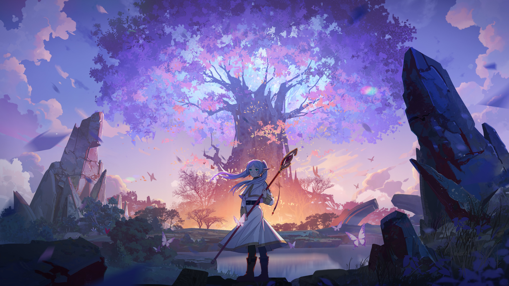
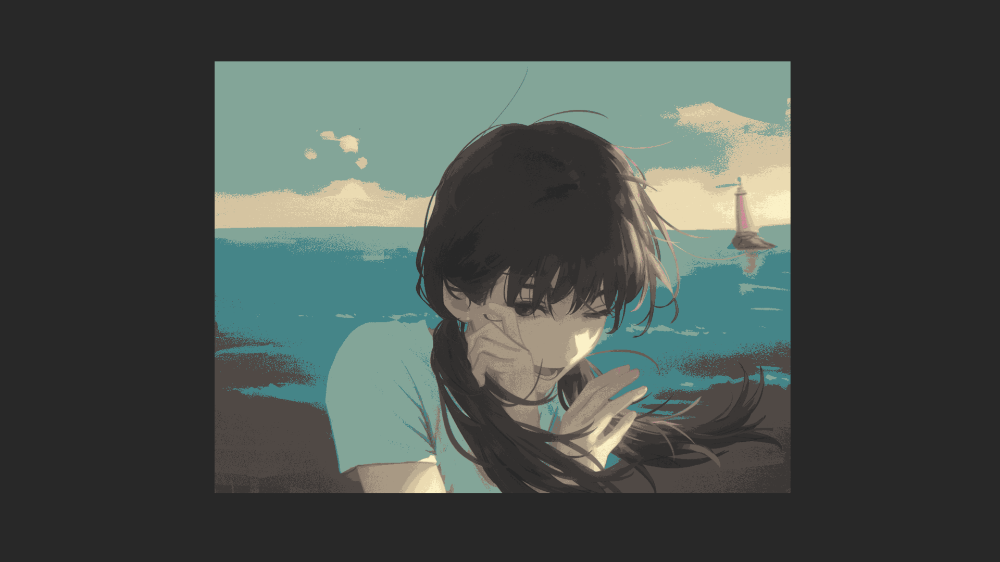
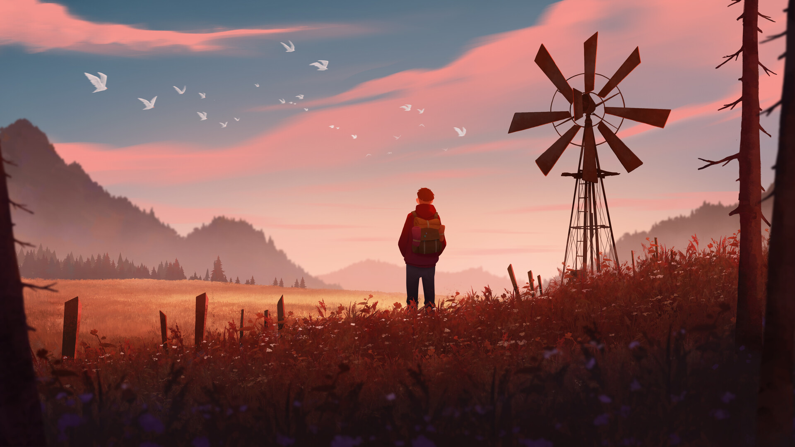
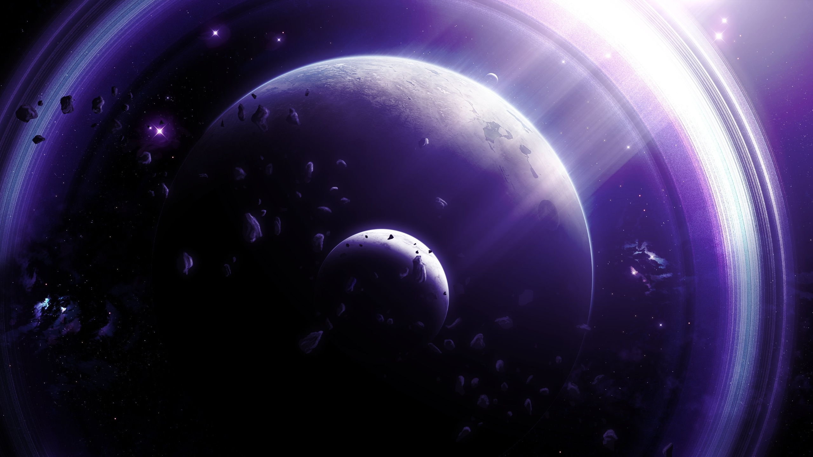
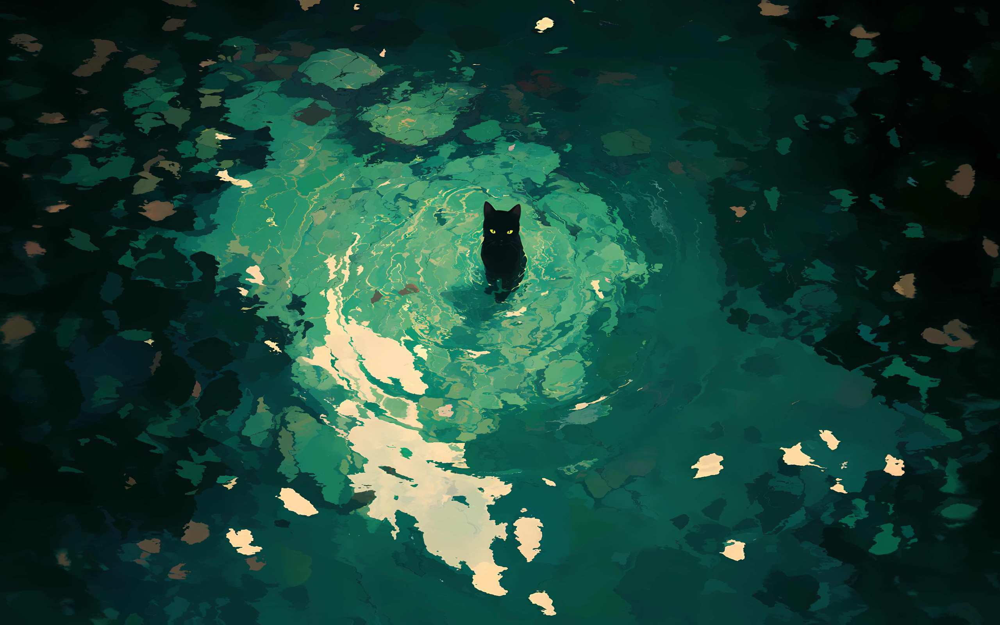
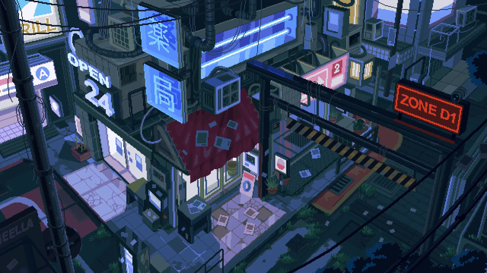

# Wallpapers

Scraped from around the internet to fit each colourschemes

# Showcases

## Frieren

 
[See full collection](./frieren/README.md)

## Hatsune Miku

 
[See full collection](./frieren/README.md)

## Kanagawa

 
[See full collection](./kanagawa/README.md)

## OneDark

 
[See full collection](./onedarkpro/README.md)

## Gruvbox

 
[See full collection](./gruvbox/README.md)

## Catppuccin

 
[See full collection](./catppuccin/README.md)

## Tokyonight

 
[See full collection](./tokyonight/README.md)

## RosePine

 
[See full collection](./rose-pine/README.md)

## Solarized

 
[See full collection](./solarized/README.md)

## Nord

 
[See full collection](./nord/README.md)

## Everforest

 
[See full collection](./everforest/README.md)

## Ascii Art

 
[See full collection](./asciiart/README.md)

# Referrences

These are the places I scraped my wallpapers from

- <https://haowallpaper.com/>
- <https://wallhaven.cc/>

I do not own these images. All credits belong to the respective artists.
